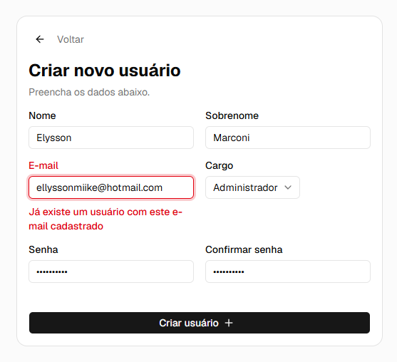
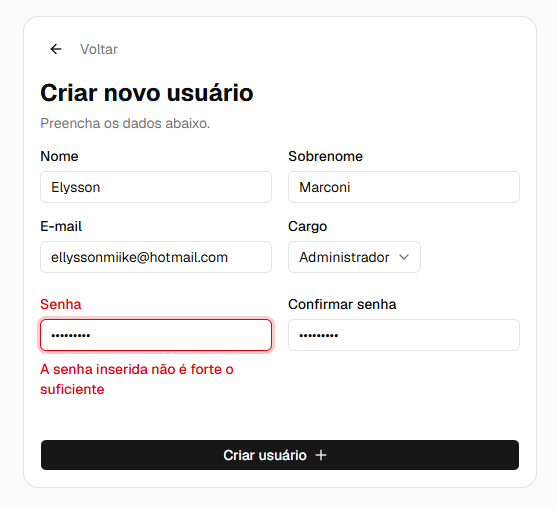

# Challenge - Desafio técnico
Este projeto é um monorepo composto por uma arquitetura de microsserviços,
desenvolvida para gerenciar ordens de serviço e processar pagamentos. Todo o
projeto foi desenhado pra rodar de forma isolada e totalmente automatizada via `Docker`.

Optei por construir um monorepo para facilitar na hora da execução, pois como são muitos serviços
é possível executar tudo de uma vez sem praticamente nenhuma configuração manual.

## Tecnologias utilizadas
- **Front (`orders-web`)**: Next.js, Tailwind, NextAuth e shadcn-ui
- **API de ordens de serviço (`orders-service`)**: Spring Boot 3.5.14, JPA, Postgres
- **Processador de pagamentos (`payment-processor`)**: Nest.js, MongoDB
- **Infra**: Docker (com docker-compose), Redis, LocalStack (AWS SQS)

## Versões
- **Java**: 21.0.10
- **Node.js**: 22.22.2

## Serviços
- `orders-web` - [http://localhost:3000](http://localhost:3000) - Interface web
- `orders-service` - [http://localhost:4000](http://localhost:4000) - Serviço de ordens
- `payment-processor` - [http://localhost:4001](http://localhost:4001) - Serviço de pagamentos
- `mongo-express` - [http://localhost:8081](http://localhost:8081) - Interface web para o **MongoDB**

Usuário e senha de acesso ao `mongo-express` para visualização dos pagamentos
```bash
USERNAME: challenge
PASSWORD: hYAicDHjNzfV4oEO
```

## Configuração
A configuração do projeto é bem simples e podemos dividir em 2 passos principais:
- Criar os arquivos `.env`
- Configurar o token da **LocalStack**

### 1. Criar os arquivos .env
Tanto o root do repositório quanto as pastas de cada serviço possuem seus devidos `.env.example`, que servem como base
para configurar todo o sistema. Todas as configurações já estão setadas para os devidos ambientes. Diminuindo a necessidade
de configuração manual.

#### Templates de configuração:
- **serviços de infra**: [.env.example](.env.example)
- **payment-processor**: [.env.example](./payment-processor/.env.example)
- **orders-service**: [.env.example](./orders-service/.env.example)
- **orders-web**: [.env.example](./orders-web/.env.example)

O primeiro passo é copiar cada arquivo. Para isso, na raíz do projeto, podemos rodar os seguintes comandos:
```bash
# configuração da infra (Postgres, MongoDB, MongoExpress, LocalStack e Redis)
$ cp .env.example .env

# configuração do serviço de ordens (orders-service)
$ cp ./orders-service/.env.example ./orders-service/.env

# configuração do front em Next.js (orders-web)
$ cp ./orders-web/.env.example ./orders-web/.env

# configuração do serviço de pagamentos em Nest.js (payment-processor)
$ cp ./payment-processor/.env.example ./payment-processor/.env

# ou.. tudo de uma vez também
$ cp .env.example .env && \
  cp ./orders-service/.env.example ./orders-service/.env && \
  cp ./orders-web/.env.example ./orders-web/.env && \
  cp ./payment-processor/.env.example ./payment-processor/.env
```

### 2. Setar a variável de ambiente **LOCALSTACK_AUTH_TOKEN**
Após os arquivos estarem devidamente nos seus devidos locais, devemos configurar apenas 1 variável
obrigatória, que é a **LOCALSTACK_AUTH_TOKEN** que se encontra [aqui](.env.example#L7), ou [aqui](.env#L7) se já copiou os arquivos no passo anterior.
```bash
# basta substituir o `secret-token` pelo seu token da LocalStack
LOCALSTACK_AUTH_TOKEN=secret-token
```

## Rodando o projeto
O ambiente foi configurado para ser o mais automatizado possível. Não é necessário instalar o Node.js ou Java na máquina local, apenas o `Docker`.

### Pré-requisitos
- [Docker](https://www.docker.com/get-started) e [Docker Compose](https://docs.docker.com/compose/install/) instalados

Com o `Docker` e `Docker Compose` instalados.. na raíz do projeto, basta rodar o seguinte comando e todos
os serviços serão iniciados e configurados automaticamente:
```bash
$ docker compose up -d
```

## Observações
Caso o projeto já tenha sido executado, ou alguma coisa foi alterada no código (fora as variáveis de ambiente), é
necessário rodar o comando de build toda vez que alguma alteração for realizada, pois não foi utilizado volume do host. Cada serviço persistente possui seu volume isolado.. então, pra isso basta executar o comando:
```bash
$ docker compose up --build -d
```

Vale salientar também, que no caso do container do `MongoDB`, se ele já foi executado alguma vez e precisar alterar o script de `init` que fica [aqui](./config/mongodb/init-db.sh), é necessário apagar o volume por inteiro por que o `MongoDB` só aplica esse script na primeira vez.. então, pra isso precisamos executar o seguinte comando que vai apagar o volume inteiro:
```bash
# apagar apenas o volume
$ docker compose down mongo -v

# ou apagar o volume e as dependências (network)
$ docker compose down mongo -v --remove-orphans
```

## Rodando sem Docker
O projeto foi desenvolvido pra rodar tanto via `Docker` com substituição de variáveis no
[docker-compose.yml](docker-compose.yml), quanto via localhost. Ou seja, podemos executar o projeto
inteiro com apenas um comando, ou executar cada um separadamente em ambiente de dev usando os respectivos comandos.

### Nest.js (payment-processor)
Para esse serviço executar corretamente, é necessário no mínimo o LocalStack e MongoDB rodando, seja através do `Docker` ou na máquina local mesmo. Com isso em mente, podemos rodar os seguintes comandos, desde que estejamos na raíz do repositório:
```bash
# instalar as dependências
$ npm install

# rodar em ambiente de desenvolvimento
$ npm run start:dev
```

### Next.js (orders-web)
Para rodar, é bem simples também, desde que possua o Node.js instalado. Para isso basta executar os seguintes comandos:
```bash
# instalar as dependências
$ cd ./orders-web && npm install

# rodar em ambiente de desenvolvimento
$ npm run dev
```

### Spring Boot (orders-service)
No caso do Spring, é bem melhor através da **IDE** usando o **IntelliJ IDEA**, mas caso queira rodar também através do terminal, podemos usar os seguintes comandos:
```bash
# instalar e compilar
$ mvn clean install

# executar
$ mvnw spring-boot:run
```

### Serviço de ordens
Como foi solicitado no desafio técnico, deixei as seguintes rotas públicas no serviço de ordens:
- **POST** `/auth/login` - Efetuar login
- **POST** `/users` - Criar usuário
- **GET** `/payment-methods` - Listar meios de pagamento

As seguintes estão bloqueadas, podendo ser acessadas apenas via token `Bearer` gerados na rota `/auth/login`:
- **POST**: `/orders` - Criar ordem de serviço (apenas **ADMIN**)
- **GET**: `/orders` - Listar ordens de serviço (apenas **MANAGER** ou **ADMIN**)

A rota de listar ordens de serviço possui alguns filtros via `QueryParams` que são:
- `buyerCpf` - Filtrar por **CPF** do comprador
- `status` - Filtrar por **status** da ordem de serviço. Os valores aceitos e suas variantes **case-insensitive:**
  - `PAID` - **Paid**, **paid** (...) - ordem paga
  - `PENDING` - **Pending**, **pending** (...) - ordem pendente
  - `CANCELED` - **Canceled**, **canceled** (...) - ordem cancelada
  - `REFUSED` - **Refused**, **refused** (...) - ordem recusada
- `paymentMethod` - Filtrar por **meio de pagamento**. Os valores aceitos e suas variantes **case-insensitive**:
  - `PIX` - **Pix**, **pix** (...)
  - `CREDIT_CARD` - **Credit_Card**, **CreditCard**, **creditCard**, **credit_card**, **creditcard** (...)
  - `DEBIT_CARD` - Segue a mesma lógica dos outros campos acima
- `sortColumn` - Colunas de ordenação (**case-insensitive**)
  - `STATUS` - **Status**, **status** (...) - status da ordem de serviço
  - `AMOUNT` - **Amount**, **amount** (...) - valor da ordem de serviço
  - `BUYER_CPF` - **Buyer_Cpf**, **BuyerCpf**, **buyerCpf**, **buyer_cpf**, **buyercpf** (...) - **CPF** do comprador
  - `BUYER_NAME` - **Buyer_Cpf**, **BuyerCpf**, **buyerCpf**, **buyer_cpf**, **buyercpf** (...) - nome do comprador
  - `PAYMENT_DATE` - **Payment_Date**, **PaymentDate**, **paymentDate**, **payment_date**, **paymentdate** (...) - data de pagamento
  - `CREATED_AT` - **Created_At**, **CreatedAt**, **createdAt**, **created_at**, **createdat** (...) - data de criação da ordem
  - `UPDATED_AT` - **Updated_At**, **UpdatedAt**, **updatedAt**, **updated_at**, **updatedat** (...) - data de atualização da ordem
- `sortDirection` - Direção da ordenação
  - `ASC` - **Asc**, **asc** (...) - ascendente
  - `DESC` - **Desc**, **desc** (...) - descendente

Todas as rotas possuem uma validação dinâmica baseada nas annotations, onde em caso de erro são retornados todos os campos com as mensagens correspondentes para o campo:
```json
{
	"timestamp": "2026-05-28T07:50:08.919223802Z",
	"requestId": "edd81652-5b32-4648-ae0e-94b51be8eafb",
	"error": "UserAlreadyExists",
	"module": "Users",
	"code": "US.CR-001",
	"message": "Já existe um usuário com este e-mail cadastrado",
	"status": 422,
	"fields": [
		{
			"field": "email",
			"message": [
				"Já existe um usuário com este e-mail cadastrado"
			]
		}
	]
}
```

Desta forma, o front está integrado com a validação do backend retornando o erro no campo correspondente, deixando a aplicação mais profissional, facilitando a manutenção e integração de novos campos conforme necessário:

| E-mail já existente | Senha muito fraca |
| :---: | :---: |
|  | 

Aproveitamos que falamos das senhas, elas precisam ter no mínimo 8 caracteres, 1 caractere minúsculo, 1 maiúsculo e 1 símbolo.

### Serviço de pagamentos
No serviço de pagamentos está tudo liberado
- **POST** `/payments/process` - Processar pagamento vindo do **orders-service**
- **PATCH** `/payments/status` - Atualizar status do pagamento no fluxo de **PIX**

No serviço de pagamentos também há esse tratamento de erros baseado em decorators, retornando os respectivos campos e mensagens de erro. Mas neste caso, como é um serviço que não é acessível ao usuário através da interface web. Não adicionei mensagens em português no fluxo dos `Controllers`, apenas no startup, [aqui](./payment-processor/src/config/config.service.ts#L76).

Nesse fluxo, ao iniciar a aplicação, são validadas todas as variáveis de ambiente necessárias para a aplicação funcionar. Se alguma estiver faltando ou for inválida, o serviço não inicia. Porém, mostra a mensagem de erro informando o que precisa ser tratado.

Porém, há a opção de iniciar a aplicação mesmo assim (isso não deixará de mostrar os erros nos logs, apenas permitirá que a aplicação inicie). Para isso, basta setar a variável de ambiente `SERVICE_THROW_ON_STARTUP_ERROR` como `false` ou `0`:
```bash
# .env
SERVICE_THROW_ON_STARTUP_ERROR=0

# ou
SERVICE_THROW_ON_STARTUP_ERROR=false
```
O padrão é `true`.

#### **Algoritmo de seleção aleatória baseado em peso (%)**
Criei uma configuração que possibilita manipular tanto a porcentagem dos status retornados, quanto os timeouts simulados dos serviços. Tá, mas o que isso quer dizer?

O serviço de pagamentos possui 2 services que simulam `Gateways de pagamento`. Como nós sabemos, nem sempre os serviços na web são estáveis, então implementei uma lógica onde conseguimos configurar faixas de porcentagem de probabilidade para cada status e para os timeouts.

**Como isso funciona?**

Pra ficar mais claro, aqui está a configuração que pode ser alterada [aqui](./payment-processor/src/payment/integration/config.ts).
```ts
export default {
  status: {
    PIX: [
      { status: PaymentStatus.PAID,     weight: 80 },
      { status: PaymentStatus.REFUSED,  weight: 10 },
      { status: PaymentStatus.CANCELED, weight: 10 },
    ],
    CREDIT_CARD: [
      { status: PaymentStatus.PAID,     weight: 80 },
      { status: PaymentStatus.REFUSED,  weight: 10 },
      { status: PaymentStatus.CANCELED, weight: 10 },
    ],
    DEBIT_CARD: [
      { status: PaymentStatus.PAID,     weight: 80 },
      { status: PaymentStatus.REFUSED,  weight: 15 },
      { status: PaymentStatus.CANCELED, weight: 5 },
    ],
  },
  timeout: [
    { weight: 85, range: { min: 0.0, max: 0.2 } },
    { weight: 10, range: { min: 0.2, max: 1.0 } },
    { weight: 3,  range: { min: 1.0, max: 5.0 } },
    { weight: 2,  range: { min: 5.0, max: 90  } },
  ],
};
```

Vamos pegar como exemplo a configuração de `status`. Nota-se que a configuração está distribuída nos meios de pagamento, onde conseguimos escolher qual a probabilidade de cada status retornar no respectivo meio quando chegar uma requisição vinda do `orders-service`.
#### **Status**
- `PIX` - Temos 80% de chance de retornar `PAID`, 10% de chance de retornar `CANCELED` ou `REFUSED`.
- `CREDIT_CARD` - Temos as mesmas chances que o **PIX**
- `DEBIT_CARD` - Temos 80% de chance de retornar `PAID`, 15% de chande de retornar `REFUSED` e 5% de chance apenas de retornar `CANCELED`.

Ou seja, utilizamos a propriedade `weight` de cada item do array para controlar a probabilidade de retorno de cada um dos status.

#### **Timeout**
A mesma lógica se aplica para os timeouts. Como falei anteriormente, nem sempre os serviços na web estão estáveis. Então, para replicar um cenário mais realista implementei essa lógica para simular como APIs reais que possuem tráfego intenso funcionam. Esse objeto define a probabilidade da API retornar num determinado tempo. Vamos extrair apenas o objeto de **timeout** pra ver mais de perto.
```ts
[
  { weight: 85, range: { min: 0.0, max: 0.2 } },
  { weight: 10, range: { min: 0.2, max: 1.0 } },
  { weight: 3,  range: { min: 1.0, max: 5.0 } },
  { weight: 2,  range: { min: 5.0, max: 90  } },
]
```
- `weight` - Novamente, o `weight` define a probabilidade em porcentagem do serviço `payment-processor` retornar uma resposta mais rápida ou mais lenta, com isso conseguimos testar mais precisamente o **Circuit Breaker** e **Retries**.
- `range` - Range define o mínimo e máximo em **segundos** que o serviço vai retornar. Ou seja, no primeiro item do array, tem 85% de chance do serviço retornar entre **0ms** e **200ms**. Dessa forma, a maioria das requisições serão mais rápidas. Se formos olhar para o último item do array. Há 2% de chance do serviço retornar entre **5 segundos** e **90 segundos**. Adicionando mais itens no array, conseguimos criar outras situações. Mas é necessário lembrar que a soma de todos os itens do array precisam dar **100** para que funcione corretamente.

#### **Swagger** ####
Para acessar a documentação das rotas, temos o endpoint `/docs`. Ao acessar este endpoint, temos uma **Basic Authentication** protegida por login e senha que se encontram [aqui](./env.example#L15).
```bash
### Swagger ###
PAYMENT_DOCS_ENABLED="1"
PAYMENT_DOCS_OPERATOR="challenge"
PAYMENT_DOCS_PASSWORD="challenge"
```
- `PAYMENT_DOCS_ENABLED` - indica se a documentação no **Swagger** estará habilitada ou não. Onde `1` ou `true` a documentação estará habilitada. Qualquer outro valor, estará desabilitada.
- `PAYMENT_DOCS_OPERATOR` - Login (*username*)
- `PAYMENT_DOCS_PASSWORD` - Senha (*password*)

### Interface web ###
No front segue a mesma lógica do serviço de ordens de serviço em relação à proteção de rotas, onde a página de criar usuários é pública pra poder criar o primeiro usuário, assim como a de login. Todas as outras rotas estão protegidas exigindo autenticação.

As rotas públicas são:
- `/login` - Efetuar login
- `/usuarios` ou `/usuarios/novo` - Criar usuário

As rotas privadas são:
- `/` - Página inicial
- `/ordens` - Página de gerenciamento de ordens de serviço